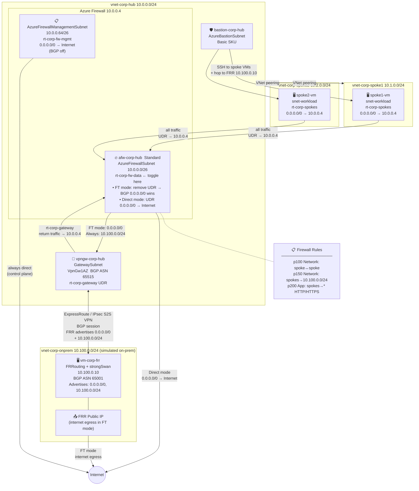

# Azure Firewall Egress Migration: Coexisting with On-Prem Default Route

For organizations with a traditional network security model — where **all internet traffic must hairpin through an on-premises security stack** — moving to Azure doesn't mean ripping that out overnight. These customers have `0.0.0.0/0` advertised via BGP over an **ExpressRoute circuit or IPsec S2S VPN** (forced tunneling), and need to **gradually shift internet egress to Azure Firewall** without touching the on-prem default route advertisement.

This Bicep lab demonstrates that migration path using a hub-and-spoke topology with a simulated on-prem site running [FRRouting](https://frrouting.org/) (FRR) + strongSwan. The core mechanism is simple: **a UDR always beats a BGP-learned route**. By adding or removing `0.0.0.0/0` on `rt-corp-fw-data`, you can move workloads to Azure egress while the on-prem BGP advertisement remains intact — no changes to the VPN or FRR config required.

The lab shows two routing modes that can be toggled via the `rt-corp-fw-data` UDR:

| Mode | `rt-corp-fw-data` on `AzureFirewallSubnet` | Internet egress public IP |
|---|---|---|
| **Forced tunnel** (on-prem egress) | No UDR — BGP `0.0.0.0/0` from FRR wins | FRR VM public IP (`172.x.x.x`) |
| **Azure egress** (migrated) | UDR `0.0.0.0/0 → Internet` overrides BGP | Azure Firewall public IP |

In both modes, spoke→on-prem traffic (via `10.100.0.0/24`) is always routed through the VPN tunnel because the BGP-learned `/24` is more specific than any `0.0.0.0/0` UDR — on-prem resources remain reachable throughout the migration.

## Table of Contents

- [Architecture](#architecture)
  - [Forced Tunneling Toggle](#forced-tunneling-toggle)
- [Route Tables](#route-tables)
- [Resources Deployed](#resources-deployed)
- [Firewall Rules](#firewall-rules)
- [Prerequisites](#prerequisites)
- [Deploy](#deploy)
- [Toggling Forced Tunneling](#toggling-forced-tunneling)
- [Accessing VMs](#accessing-vms)

## Architecture



### Forced Tunneling Toggle

| Mode | `rt-corp-fw-data` on `AzureFirewallSubnet` | Internet egress |
|------|-------------------------------------------|-----------------|
| **Forced tunnel** | Removed — BGP `0.0.0.0/0` from FRR wins | FRR VM public IP |
| **Direct internet** | `0.0.0.0/0 → Internet` UDR applied | Azure Firewall public IP |

> The management subnet (`AzureFirewallManagementSubnet`) always has a direct `0.0.0.0/0 → Internet` UDR, keeping Azure's firewall control plane reachable regardless of mode.

## Route Tables

| Route Table | Attached To | Routes | BGP Propagation |
|---|---|---|---|
| `rt-corp-fw-mgmt` | `AzureFirewallManagementSubnet` | `0.0.0.0/0 → Internet` | Disabled |
| `rt-corp-fw-data` | `AzureFirewallSubnet` | `0.0.0.0/0 → Internet` *(optional — remove to enable forced tunnel)* | **Enabled** |
| `rt-corp-spokes` | Both spoke `snet-workload` subnets | `0.0.0.0/0 → 10.0.0.4` | Disabled |
| `rt-corp-gateway` | `GatewaySubnet` | `10.1.0.0/24 → 10.0.0.4`, `10.2.0.0/24 → 10.0.0.4` | Enabled |

> **Why `rt-corp-gateway`?** When FRR sends return traffic back through the VPN tunnel, the VPN Gateway receives it and must forward it to the spoke VMs. Without a UDR, it routes directly to the peered spoke VNets — bypassing the firewall and causing asymmetric routing that drops TCP sessions. The gateway route table forces return traffic back through the firewall so both directions are inspected.

## Resources Deployed

| Resource | Name | Details |
|---|---|---|
| Resource Group | `rg-corp-network-centralus` | Central US |
| Log Analytics | `log-corp-hub` | 30-day retention |
| Hub VNet | `vnet-corp-hub` | 10.0.0.0/24 |
| Azure Firewall | `afw-corp-hub` | Standard, zone-redundant, private IP 10.0.0.4 |
| Firewall Policy | `afwp-corp-hub` | Standard, threat intel: Alert |
| Azure Bastion | `bastion-corp-hub` | Basic SKU |
| VPN Gateway | `vpngw-corp-hub` | VpnGw1AZ, BGP ASN 65515 |
| Spoke 1 VNet | `vnet-corp-spoke1` | 10.1.0.0/24 |
| Spoke 2 VNet | `vnet-corp-spoke2` | 10.2.0.0/24 |
| On-prem VNet | `vnet-corp-onprem` | 10.100.0.0/24 (simulated) |
| FRR VM | `vm-corp-frr` | Ubuntu 22.04, Standard_B2s, FRRouting + strongSwan |
| Local Network Gateway | `lgn-corp-onprem` | BGP ASN 65001, peer 10.100.0.10 |
| VPN Connection | `con-corp-onprem` | BGP-enabled S2S IPsec |

## Firewall Rules

| Priority | Type | Name | Source | Destination | Action |
|---|---|---|---|---|---|
| 100 | Network | `net-allow-spoke-to-spoke` | 10.1.0.0/24, 10.2.0.0/24 | 10.1.0.0/24, 10.2.0.0/24 | Allow |
| 150 | Network | `net-allow-spokes-to-onprem` | 10.1.0.0/24, 10.2.0.0/24 | 10.100.0.0/24 | Allow |
| 200 | Application | `app-allow-internet-egress` | 10.1.0.0/24, 10.2.0.0/24 | `*` HTTP/HTTPS | Allow |

## Prerequisites

- [Azure CLI](https://learn.microsoft.com/cli/azure/install-azure-cli) + Bicep CLI (`az bicep install`)
- Contributor access on the target subscription

## Deploy

1. Fill in `Set-Env.ps1` with your secrets (it is gitignored):

```powershell
$env:VM_ADMIN_PASSWORD = "your-vm-password"
$env:VPN_PSK           = "your-ipsec-psk"
```

2. Source it and deploy:

```powershell
. .\Set-Env.ps1
az deployment sub create `
  --name azure-firewall-ft-lab `
  --location centralus `
  --template-file infra/main.bicep `
  --parameters infra/main.bicepparam
```

Deployment takes approximately **20-25 minutes** (VPN Gateway dominates).

## Toggling Forced Tunneling

**Enable forced tunnel** (internet via FRR VM):
```bash
az network vnet subnet update -g rg-corp-network-centralus \
  --vnet-name vnet-corp-hub -n AzureFirewallSubnet --route-table ""
```

**Disable forced tunnel** (internet direct via Azure Firewall):
```bash
az network vnet subnet update -g rg-corp-network-centralus \
  --vnet-name vnet-corp-hub -n AzureFirewallSubnet \
  --route-table rt-corp-fw-data
```

## Accessing VMs

Use Azure Bastion (`bastion-corp-hub`) to connect to spoke VMs, then SSH from there to the FRR VM:

```bash
ssh azureuser@10.100.0.10
```


A Bicep-based deployment of a hub-and-spoke network topology in Azure with an Azure Firewall (Standard tier) including a dedicated management interface.

The management interface (`AzureFirewallManagementSubnet` + dedicated public IP) provides an out-of-band path for Azure's control plane, independent of data-plane traffic. See [Azure Firewall forced tunneling](https://learn.microsoft.com/azure/firewall/forced-tunneling) for full details. You need it when:

- **Forced tunneling is enabled** — `0.0.0.0/0` on `AzureFirewallSubnet` points to on-premises via ExpressRoute/VPN. Without a management interface, Azure loses the ability to reach the firewall for health monitoring and updates.
- **NVA chaining** — Azure Firewall sits behind a third-party NVA (Zscaler, Palo Alto, Fortinet) and a UDR on `AzureFirewallSubnet` points to that NVA instead of the internet.
- **Compliance mandates (FedRAMP, DoD IL4/5, PCI-DSS)** — policies that prohibit any default internet egress without inspection make forced tunneling non-negotiable, which in turn requires the management interface.
- **Private/zero-trust deployments** — the firewall's data-plane public IP is removed entirely and all egress is private; the management interface keeps Azure platform operations functional.

## Architecture

Hub VNet (`10.0.0.0/24`) containing the Azure Firewall, peered to two spoke VNets. All spoke egress is routed through the firewall via UDRs.

- **Hub**: `vnet-corp-hub` — `AzureFirewallSubnet` (10.0.0.0/26) + `AzureFirewallManagementSubnet` (10.0.0.64/26)
- **Spoke 1**: `vnet-corp-spoke1` — workload subnet (10.1.0.0/24), UDR → firewall
- **Spoke 2**: `vnet-corp-spoke2` — workload subnet (10.2.0.0/24), UDR → firewall

### Resources Deployed

| Resource | Name | Details |
|---|---|---|
| Resource Group | `rg-corp-network-centralus` | Central US |
| Log Analytics Workspace | `log-corp-hub` | 30-day retention |
| Hub VNet | `vnet-corp-hub` | 10.0.0.0/24 |
| Azure Firewall | `afw-corp-hub` | Standard tier, zone-redundant, private IP 10.0.0.4 |
| Firewall Policy | `afwp-corp-hub` | Standard tier, threat intel: Alert |
| Rule Collection Group | `rcg-corp-default` | See Firewall Rules below |
| Firewall PIP (data) | `pip-corp-fw` | Standard SKU, static, zone-redundant |
| Firewall PIP (mgmt) | `pip-corp-fw-mgmt` | Standard SKU, static, zone-redundant — dedicated management interface |
| Spoke 1 VNet | `vnet-corp-spoke1` | 10.1.0.0/24 |
| Spoke 2 VNet | `vnet-corp-spoke2` | 10.2.0.0/24 |
| Route Table (spoke1) | `rt-corp-spoke1` | 0.0.0.0/0 → 10.0.0.4, 10.2.0.0/24 → 10.0.0.4 |
| Route Table (spoke2) | `rt-corp-spoke2` | 0.0.0.0/0 → 10.0.0.4, 10.1.0.0/24 → 10.0.0.4 |

### Key Design Decisions

- **Management interface**: The firewall has a dedicated `AzureFirewallManagementSubnet` with its own public IP, providing an out-of-band path that Azure uses to manage the firewall independently of data-plane traffic. This is needed whenever a UDR on `AzureFirewallSubnet` overrides the default route — without it, Azure loses the ability to reach the firewall for health monitoring and updates. Common scenarios where this applies:
  - **Forced tunneling to on-premises** — routing all internet-bound firewall traffic back through ExpressRoute or VPN to a corporate security stack. The management interface ensures Azure's control plane can still reach the firewall even when `0.0.0.0/0` points on-prem.
  - **NVA sandwich / firewall chaining** — Azure Firewall sitting behind a third-party NVA (e.g. Zscaler, Palo Alto, Fortinet), where a UDR on `AzureFirewallSubnet` points to the NVA instead of the internet.
  - **Strict compliance environments** — FedRAMP High, DoD IL4/5, PCI-DSS — where policy mandates no traffic leaves via a default internet route without explicit inspection, making forced tunneling non-negotiable.
  - **Zero-trust / private-only deployments** — environments where the firewall's data-plane public IP is removed entirely and all egress is private; the management interface keeps Azure's platform operations functional.
  
  In this lab the UDRs are only on the spoke subnets, so the management interface is not strictly required today — it is included to avoid a breaking change if forced tunneling is enabled later.
- **Firewall Policy**: A `firewallPolicies` resource is used (vs. classic rules) — the recommended modern approach allowing rule inheritance and hierarchy.
- **UDRs on spokes**: Both spoke workload subnets have UDRs for `0.0.0.0/0` **and** an explicit route for the other spoke's /16 prefix, both pointing to the firewall. The explicit /16 routes override the more-specific peering system routes, ensuring spoke-to-spoke traffic is inspected rather than bypassing the firewall.
- **BGP propagation disabled**: Route tables have `disableBgpRoutePropagation: true` to prevent gateway routes from overriding the firewall UDRs.
- **Bidirectional peerings**: Both hub→spoke and spoke→hub peerings are created with `allowForwardedTraffic: true`.
- **Availability Zones**: The firewall and both public IPs are deployed across zones 1, 2, and 3 by default. Set the `zones` parameter to `[]` for regions that do not support Availability Zones (e.g. West US).
- **Diagnostic logging**: All firewall log categories (`AzureFirewallApplicationRule`, `AzureFirewallNetworkRule`, `AzureFirewallDnsProxy`) and metrics are streamed to the Log Analytics workspace.

### Firewall Rules

All traffic is denied by default. The following rules are defined in `rcg-corp-default`:

| Priority | Type | Name | Source | Destination | Action |
|---|---|---|---|---|---|
| 100 | Network | `allow-spoke-to-spoke` | 10.1.0.0/24, 10.2.0.0/24 | 10.1.0.0/24, 10.2.0.0/24 | Allow |
| 200 | Application | `allow-http-https` | 10.1.0.0/24, 10.2.0.0/24 | `*` (HTTP/HTTPS) | Allow |

## Prerequisites

- [Azure CLI](https://learn.microsoft.com/cli/azure/install-azure-cli) installed and logged in (`az login`)
- Bicep CLI — installed automatically by Azure CLI
- Contributor access on the target subscription

## Deploy

```bash
az deployment sub create \
  --name hub-spoke-deployment \
  --location centralus \
  --template-file infra/main.bicep \
  --parameters infra/main.bicepparam \
  --subscription <your-subscription-id>
```

Deployment takes approximately **8-10 minutes**, most of which is Azure Firewall provisioning.

## Customise

Edit `infra/main.bicepparam` to change the prefix, region, or zone configuration:

```bicep
using './main.bicep'

param location = 'centralus'     // any Azure region
param prefix   = 'corp'          // resource name prefix
param zones    = ['1', '2', '3'] // set to [] for regions without Availability Zone support (e.g. westus)
```

## Teardown

```bash
az group delete \
  --name rg-corp-network-centralus \
  --subscription <your-subscription-id> \
  --yes
```

## Next Steps

- Deploy workload VMs or App Service environments into the spoke subnets
- Add an **Azure VPN Gateway** or **ExpressRoute** to the hub for on-premises connectivity
